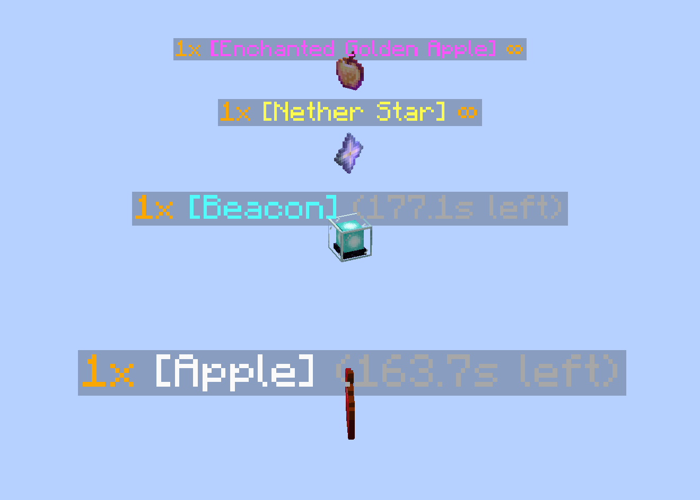

[English](./README_EN.md)

# Echoflt

  
  
  

### 概述
为掉落物显示数量、名称和消失时间。

灵感来自 https://hackmd.io/@mango-minecraft-notes/KubeJS-Notes#物品實體名稱高亮顯示 (同款风格)，因为它似乎不适用于 KubeJS 5。

### 画廊

### 编译
- 克隆本仓库。
- 打开命令行并定位到仓库目录。
- 运行 `gradlew build` 来编译模组。
- 编译好的模组生成在 `forge/build/libs` 和 `fabric/build/libs`。